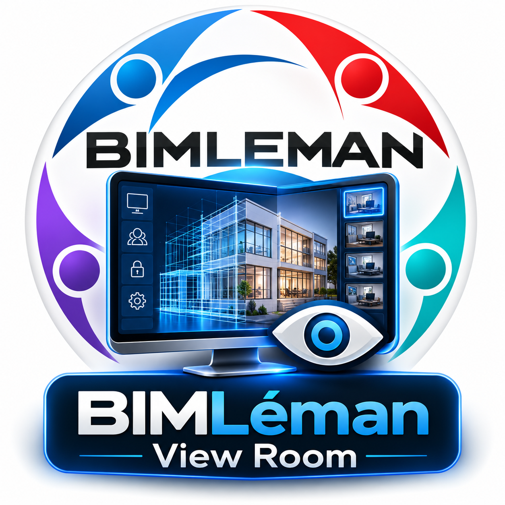

# BIMLéman View Room

**BIMLéman View Room** est une application de supervision pédagogique destinée à un centre de formation équipé de **24 PC Windows répartis dans 3 salles de 8 postes**.

Le projet est pensé pour être **développé sous Linux avec Cursor**, puis compilé en application Windows via une CI Windows. Le moteur de contrôle distant est **Veyon** : BIMLéman View Room apporte l'expérience utilisateur, les salles, l'inventaire, les permissions, l'audit et l'orchestration.



## Architecture finale

```text
PC Linux du développeur
  Cursor + Bun + React + Tauri
  └─ Mode MOCK : 24 PC simulés
            │
            │ git push / tag
            ▼
GitHub Actions / Windows
  └─ BIMLeman-View-Room-Setup.exe
            │
            ▼
PC Windows FORMATEUR
  BIMLéman View Room
  + Veyon complet
  + clé PRIVÉE teacher
            │ LAN école
     ┌──────┼──────┐
     ▼      ▼      ▼
  Salle A Salle B Salle C
   8 PC    8 PC    8 PC
     └── Veyon Service + clé PUBLIQUE teacher
```

## Règle de déploiement

### Sur les 24 PC élèves

Installer uniquement :

- Veyon Service ;
- configuration Veyon commune ;
- clé publique `teacher/public` ;
- aucune clé privée ;
- aucun outil BIMLéman View Room nécessaire.

### Sur le PC formateur

Installer :

- Veyon complet ;
- BIMLéman View Room ;
- clé privée `teacher/private` protégée ;
- inventaire des trois salles.

## Développement Linux

```bash
./scripts/dev/bootstrap-linux.sh --check
bun install
bun run dev
```

L'application détecte Linux et démarre en **mode mock**. Les 24 postes sont simulés, donc toute l'interface peut être développée sans être physiquement dans l'école.

## Production Windows

Le chemin recommandé est la CI Windows :

1. pousser le dépôt sur GitHub ;
2. créer un tag `v0.1.0` ;
3. le workflow `.github/workflows/windows-release.yml` construit l'application ;
4. récupérer l'artefact NSIS `BIMLéman View Room_*_x64-setup.exe`.

Tauri peut être cross-compilé depuis Linux, mais le dépôt considère **Windows CI comme la référence de production**.

## Ordre de déploiement réel

1. Lire `docs/00-START-HERE.md`.
2. Installer le poste formateur.
3. Configurer **un seul poste pilote** `SALLE-A-PC01`.
4. Tester vue / contrôle / verrouillage.
5. Exporter la configuration Veyon validée.
6. Déployer les 7 autres PC de la Salle A.
7. Valider la salle complète.
8. Déployer les salles B et C.
9. Lancer `deploy/common/Test-AllComputers.ps1`.
10. N'activer le mode REAL de BIMLéman View Room qu'après réussite des gates.

## Cursor

Cursor doit commencer par lire :

- `AGENTS.md`
- `.cursor/rules/*`
- `CURSOR-MASTER-TASK.md`
- `docs/*`

Le dépôt contient une règle d'autonomie : **ne pas redemander au propriétaire les décisions déjà définies dans ce repository**. Si un détail technique manque, l'agent doit choisir l'option la plus sûre, la documenter et continuer.

## Sécurité

Cet outil est destiné aux ordinateurs administrés de l'établissement et à l'assistance pédagogique. Il ne doit pas être transformé en mécanisme furtif de surveillance. Aucun keylogging, aucune capture permanente et aucun contrôle de machines extérieures au parc géré ne font partie du produit.
